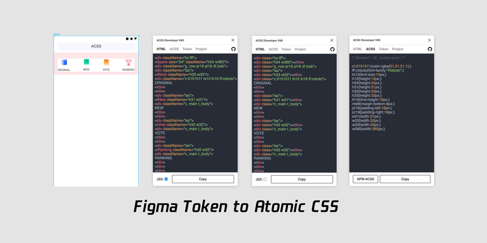

Generate the node to Html with CSS. 

The plugin read element you select and let you export them into Html with CSS.

If the element with Auto layout it will go to flex.

## Feature

- HTML: Elements => HTML;
- CSS: Element Style => CSS;
- Project: Manage the token you custom and upload;
- Token: All component and styles in current figma file, you can download as JSON and custom them and upload at 「 Project 」;

There are 2 way to use SACSS.

## Pure way:

This way you do not need setting, just open and generator.

The element will transform to the Atomic CSS.

- font-size： .fs12{ font-size: 12px; };
- font-weight：.fw700{ font-weight: 700; };
- font-style：fsi{ font-style: italic; };
- line-height：.lh16{ line-height: 16px; };
- text-align：tac{ text-align: center; };
- text-transform：.ttc{ text-transform: capitalize; };
- padding: .pb16{ padding-bottom:16px; }
- flex: .df{ display:flex; }

* SACSS「 Static Atomic css 」: Each css selector with only one css rules.

you need `$ npm install sacss` first.

[https://www.npmjs.com/package/sacss](https://www.npmjs.com/package/sacss)

## Custom way:

- You can give each local style name a alias as the css selector in Token.
- When the generator match the rules, it will turn out to be the html and the CSS.
- Even you can custom a Component.

The other stuff you don't give alias will use SACSS instead

## Token

- fill
- text
- effect
- stroke
- grid
- effect
- component
- padding
- flex

All of them are token.

## FAG

1. I can't open the plugin of SACSS in the first time?

Try 3 times and wait.

2. How to ignore some local styles name?

Just set those style name with `_` start.

exp: `_Header`

4. I wanna knonw more about SACSS in code

[https://ziven27.github.io/sacss](ziven27.github.io/sacss)
